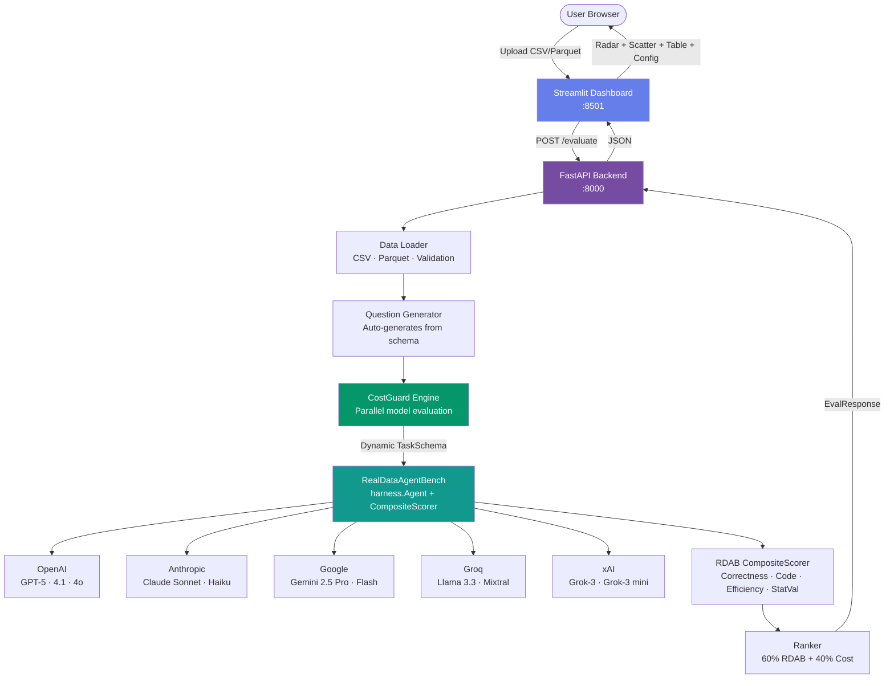

# CostGuard

> **Stop guessing which LLM to use. CostGuard benchmarks 10 models against your actual data — Simulation mode in under 15 seconds, Live mode in 1–3 minutes — and tells you exactly what it will cost.**

[](https://github.com/patibandlavenkatamanideep/CostGuard/actions)
[](https://python.org)
[](LICENSE)
[](https://github.com/patibandlavenkatamanideep/RealDataAgentBench)
[](https://costguard-production-3afa.up.railway.app)

---

---

## Try It Now

**[costguard-production-3afa.up.railway.app](https://costguard-production-3afa.up.railway.app)**

No account. No API keys. No setup. Upload a CSV or Parquet file and get your answer in **under 15 seconds** (Simulation mode) or **1–3 minutes** (Live mode with your own API keys).

> 🔒 **Privacy:** your file is processed entirely in memory and never written to disk or stored.

> Most teams are overpaying for LLMs by 10–20× — using GPT-4o for tasks a $0.0001/1K model handles just as well. CostGuard shows you exactly which model fits your data, what it will cost per run, and how much you save versus the alternatives.

**Prefer to self-host?** Run it locally in one command — no Railway account needed:

```bash
git clone https://github.com/patibandlavenkatamanideep/CostGuard.git && cd CostGuard
cp .env.example .env  # add API keys optionally
docker compose up
# Dashboard → http://localhost:8501 · API docs → http://localhost:8000/docs
```

**How it works in 4 steps:**

1. **Upload** — drop any CSV or Parquet file (or use a built-in sample dataset)
2. **Benchmark** — CostGuard evaluates 10 benchmarked LLMs against your actual data using [RealDataAgentBench](https://github.com/patibandlavenkatamanideep/RealDataAgentBench)
3. **Compare** — see RDAB score, cost per run, latency, and a 4-dimension scorecard for every model
4. **Deploy** — copy the one-click config and paste it straight into your project

The live result screen shows three numbers front and center: **Best Model**, **Estimated Cost per run**, and **Potential Savings** vs the most expensive alternative. Everything else is detail.

---

## What is CostGuard?

Most teams pick an LLM and stick with it — often overpaying by 10–20× for tasks a cheaper model handles just as well. CostGuard fixes that.

Upload any CSV or Parquet file. CostGuard runs your data through **[RealDataAgentBench](https://github.com/patibandlavenkatamanideep/RealDataAgentBench)** — a 4-dimensional evaluation harness — across 10 benchmarked LLMs, then surfaces:

- **Best model recommendation** ranked by RDAB score + exact cost
- **Per-run cost estimate** down to $0.000001 precision
- **One-click copyable config** — paste directly into your project
- **Radar chart** comparing Correctness · Code Quality · Efficiency · Stat Validity

No account. Your data is processed in memory and never stored. Simulation results in under 15 seconds; Live mode takes 1–3 minutes.

---

## Architecture



---

## Supported Models

CostGuard supports 15 models for Live Mode evaluation. The 10 models marked with ✓ have full RDAB benchmark data (163 runs · 23 tasks) and power Simulation Mode results.

| Model | Provider | Tier | Input $/1K | RDAB |
|-------|----------|------|-----------|:----:|
| Claude Sonnet 4.6 | Anthropic | Premium | $0.003 | ✓ Default model |
| Claude Opus 4.6 | Anthropic | Premium | $0.015 | ✓ Highest capability |
| Claude Haiku 4.5 | Anthropic | Economy | $0.00025 | ✓ Token-inefficient vs peers |
| **GPT-4.1** | OpenAI | Premium | **$0.002** | ✓ **Cost-performance leader** |
| GPT-4.1 mini | OpenAI | Balanced | $0.0004 | Live Mode only |
| GPT-4.1 nano | OpenAI | Economy | $0.0001 | Live Mode only |
| GPT-4o | OpenAI | Premium | $0.0025 | ✓ Proven reliability |
| GPT-4o mini | OpenAI | Balanced | $0.00015 | ✓ Strong cost-efficiency |
| GPT-5 | OpenAI | Premium | $0.015 | ✓ Max capability, 16× GPT-4.1 cost |
| **Gemini 2.5 Flash** | Google | Economy | **$0.000075** | ✓ **Cheapest overall** |
| Gemini 2.5 Pro | Google | Premium | $0.00125 | Live Mode only |
| Llama 3.3 70B (Groq) | Groq | Balanced | $0.00059 | ✓ Best on modeling tasks |
| Mixtral 8x7B (Groq) | Groq | Economy | $0.00024 | Live Mode only |
| Grok-3 | xAI | Premium | $0.003 | Live Mode only |
| Grok-3 mini | xAI | Balanced | $0.0003 | ✓ sklearn blind spot (RDAB) |

---

## Quickstart (Local)

### 1. Clone & configure

```bash
git clone https://github.com/patibandlavenkatamanideep/CostGuard.git
cd CostGuard

cp .env.example .env
# Optional: add API keys for Live Mode. Leave blank for Simulation Mode.
```

### 2. Install & run

```bash
pip install -e .
./scripts/dev.sh
```

Open:
- Dashboard: **http://localhost:8501**
- API Docs: **http://localhost:8000/docs**

### 3. Docker

```bash
cp .env.example .env
docker compose up
```

---

## Deploy to Railway

[](https://railway.app/new/template?template=https://github.com/patibandlavenkatamanideep/CostGuard)

**Exact steps:**

```bash
# 1. Install the Railway CLI
npm install -g @railway/cli

# 2. Authenticate
railway login

# 3. Link or create a project
railway init

# 4. Deploy (Railway reads railway.json automatically)
railway up

# 5. Get your public URL
railway open
```

**Environment variables** (all optional — app fully works in Simulation Mode without any keys):

| Variable | Purpose |
|---|---|
| `ANTHROPIC_API_KEY` | Enable Claude models in Live Mode |
| `OPENAI_API_KEY` | Enable GPT models in Live Mode |
| `GROQ_API_KEY` | Enable Llama / Mixtral via Groq |
| `GEMINI_API_KEY` | Enable Gemini 2.5 Pro / Flash |
| `XAI_API_KEY` | Enable Grok-3 / Grok-3 mini |

> The container runs FastAPI (internal, port 8000) + Streamlit (public, `$PORT`) side-by-side via `scripts/start.sh`.

---

## API Reference

Auto-documented at `/docs` (Swagger) and `/redoc`.

### POST `/evaluate`

```bash
curl -X POST https://costguard-production-3afa.up.railway.app/evaluate \
  -F "file=@my_data.csv" \
  -F "task_description=Analyze customer churn patterns" \
  -F "num_questions=5"
```

**Response:**
```json
{
  "eval_id": "a3f9e1b2",
  "status": "completed",
  "dataset_stats": { "rows": 5000, "columns": 12 },
  "recommended_model": {
    "model_id": "gpt-4o-mini",
    "display_name": "GPT-4o mini",
    "accuracy_score": 0.87,
    "estimated_total_cost_usd": 0.000423,
    "latency_ms": 612
  },
  "recommendation_reason": "GPT-4o mini achieves the best balance...",
  "copyable_config": "{ \"model\": \"gpt-4o-mini\", ... }"
}
```

### GET `/health`
```bash
curl https://costguard-production-3afa.up.railway.app/health
```

### GET `/models`
```bash
curl https://costguard-production-3afa.up.railway.app/models
```

---

## RDAB Scoring Methodology

CostGuard uses [RealDataAgentBench](https://github.com/patibandlavenkatamanideep/RealDataAgentBench) as its evaluation engine, scoring each model across **4 dimensions**:

| Dimension | Weight | What It Measures |
|-----------|--------|-----------------|
| **Correctness** | 50% | Answer accuracy vs ground truth (fuzzy-matched, ±15% tolerance) |
| **Code Quality** | 20% | Vectorised operations, naming conventions, no magic numbers |
| **Efficiency** | 15% | Token + step budget adherence (Easy: 20K tokens, Medium: 50K) |
| **Stat Validity** | 15% | Reports p-values, confidence intervals, avoids p-hacking |

### Key RDAB Benchmark Findings (163 runs)

- **GPT-4.1** = best cost-performance ratio ($0.038/task vs GPT-5's $0.596)
- **Gemini 2.5 Flash** = cheapest per RDAB score ($0.000075/1K input)
- **Llama 3.3-70B (Groq)** = outperforms on modeling tasks
- **Claude Haiku** = consumed 608K tokens vs GPT-4.1's 30K on the same task
- **Universal weakness**: all models score ~0.25 on stat_validity

---

## Business Impact

| Use Case | Without CostGuard | With CostGuard |
|----------|------------------|----------------|
| Model selection | 2–3 days of testing | **15 seconds** |
| Cost budgeting | Guesswork | Exact per-run estimates |
| Over-provisioning | ~60% of teams use GPT-4o for tasks GPT-4.1 handles at 20% of the cost | Right-sized model every time |
| Onboarding | Engineers research models manually | Copy one config block |

### Example savings (from RDAB benchmark data)

| Scenario | Old choice | CostGuard pick | Savings |
|----------|-----------|----------------|---------|
| Structured data analysis | GPT-4o: $0.0025/1K | GPT-4.1: $0.002/1K | **20% cheaper, same quality** |
| Budget inference at scale | GPT-4o: $0.0025/1K | GPT-4o-mini: $0.00015/1K | **94% cheaper**, <5% accuracy drop |
| Cheapest viable option | Claude Sonnet: $0.003/1K | Gemini 2.5 Flash: $0.000075/1K | **97.5% cheaper** |
| Worst over-provisioning (RDAB) | Claude Haiku: 608K tokens | GPT-4.1: 30K tokens | **Same task — 20× fewer tokens** |

> GPT-5 costs $0.015/1K input — 200× more than Gemini 2.5 Flash. CostGuard tells you when that premium is justified.

---

## Project Structure

```
costguard/
├── backend/
│   ├── main.py          # FastAPI app, routes, middleware
│   ├── config.py        # Pydantic settings, env vars
│   ├── models.py        # Request/response schemas
│   └── logger.py        # Structured logging
├── evaluation/
│   ├── engine.py        # Core evaluation orchestrator
│   ├── data_loader.py   # CSV/Parquet ingestion & validation
│   ├── pricing.py       # Model pricing catalogue
│   ├── question_generator.py  # RDAB-style question generation
│   └── token_counter.py # Token estimation
├── frontend/
│   └── app.py           # Streamlit dashboard
├── tests/
│   └── test_evaluation.py
├── scripts/
│   ├── dev.sh           # Local dev startup
│   └── start.sh         # Production single-container startup
├── .github/workflows/ci.yml
├── Dockerfile
├── docker-compose.yml
├── railway.json
├── render.yaml
└── pyproject.toml
```

---

## Development

```bash
# Run tests
pytest tests/ -v

# Integration tests (requires running server)
pytest tests/ -m integration

# Lint & format
ruff check .
ruff format .

# Type check
mypy backend/ evaluation/
```

---

## Layer 4 — Observability & Alerting

CostGuard includes a lightweight observability layer that logs every evaluation, tracks score history, and detects model degradation automatically.

### What it does

| Capability | Detail |
|---|---|
| **Evaluation logging** | Every run is persisted to a local SQLite file (no external service required) |
| **Historical averages** | Per-model average RDAB scores accumulate across runs |
| **Drift detection** | If a model's current score drops >10% below its historical average, a drift event is recorded |
| **Slack alerts** | Optional Slack webhook fires automatically when drift is detected |
| **History & Alerts tab** | A dedicated Streamlit tab shows recent evaluations, drift events, and model averages |

### Storage

**Your uploaded data is never stored.** CostGuard writes only evaluation metadata — model scores, cost estimates, timestamps, and a dataset fingerprint (SHA-256 hash) — to a local SQLite file. The raw file contents are processed entirely in memory and discarded immediately after scoring.

All metadata is written to a single SQLite file (default: `/tmp/costguard_history.db`). Override the path:

```bash
export COSTGUARD_DB_PATH=/var/data/costguard.db
```

Two tables:
- `evaluations` — one row per completed evaluation (model, scores, cost, timestamp, dataset hash)
- `drift_events` — recorded when a model's score drops >10% below its historical average

### Slack alerts (optional)

Set `SLACK_WEBHOOK_URL` in your environment to enable drift notifications:

```bash
export SLACK_WEBHOOK_URL=https://hooks.slack.com/services/T.../B.../...
```

Alert fires only when drift is detected and the webhook is configured. No webhook = silent logging only.

### Business value

- **Catch regressions early** — if a provider silently degrades, you'll know before it affects production workloads.
- **Audit trail** — every recommendation is logged with a dataset fingerprint, making it trivial to replay or dispute a cost decision.
- **Trend analysis** — the Model Averages tab shows which models are consistently strong on your data type over time, not just on a single run.
- **Zero infra overhead** — SQLite means no Postgres, Redis, or external service to operate. Works out of the box on Railway and local dev.

---

## Contributing

See [CONTRIBUTING.md](CONTRIBUTING.md).

---

## Security

See [SECURITY.md](SECURITY.md). Report vulnerabilities to security@costguard.dev.

---

## License

MIT — see [LICENSE](LICENSE).

---

*Built with FastAPI, Streamlit, and RealDataAgentBench. The best model is the one that fits your data — and your budget.*
