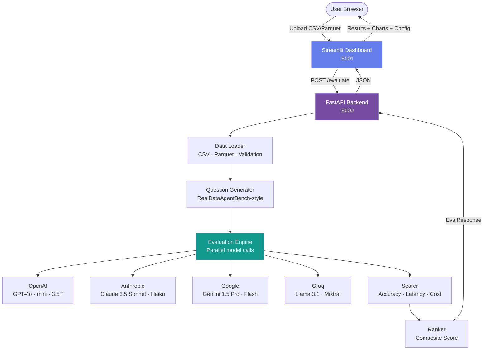

# CostGuard

> **Instantly find the best LLM for your data — with exact cost estimates.**

[](https://github.com/your-org/costguard/actions)
[](https://python.org)
[](LICENSE)
[](https://costguard.up.railway.app)

---

## What is CostGuard?

Upload any CSV or Parquet file → CostGuard benchmarks **8+ major LLMs** against your actual data and returns:

-  **Best model recommendation** with confidence reasoning
-  **Exact cost estimate** per run (down to $0.000001)
-  **One-click copyable config** — paste directly into your project
-  **Interactive charts** comparing accuracy, latency, and cost across all models

No account required. No data stored. Works in under 15 seconds.

---

## Live Demo

**[costguard.up.railway.app](https://costguard.up.railway.app)**

---

## Architecture



---

## Supported Models

| Model | Provider | Tier | Input $/1K | Output $/1K |
|-------|----------|------|-----------|------------|
| GPT-4o | OpenAI | Premium | $0.0025 | $0.010 |
| GPT-4o mini | OpenAI | Balanced | $0.00015 | $0.00060 |
| GPT-3.5 Turbo | OpenAI | Economy | $0.0005 | $0.0015 |
| Claude 3.5 Sonnet | Anthropic | Premium | $0.003 | $0.015 |
| Claude 3.5 Haiku | Anthropic | Balanced | $0.0008 | $0.004 |
| Claude 3 Haiku | Anthropic | Economy | $0.00025 | $0.00125 |
| Gemini 1.5 Pro | Google | Premium | $0.00125 | $0.005 |
| Gemini 1.5 Flash | Google | Balanced | $0.000075 | $0.0003 |
| Llama 3.1 70B (Groq) | Groq | Economy | $0.00059 | $0.00079 |
| Mixtral 8x7B (Groq) | Groq | Economy | $0.00024 | $0.00024 |

---

## Quickstart (Local)

### 1. Clone & configure

```bash
git clone https://github.com/your-org/costguard.git
cd costguard

cp .env.example .env
# Edit .env and add your API keys (at least one of OPENAI_API_KEY or ANTHROPIC_API_KEY)
```

### 2. Install & run

```bash
pip install -e .
./scripts/dev.sh
```

Then open:
- Dashboard: **http://localhost:8501**
- API Docs: **http://localhost:8000/docs**

### 3. Docker (production)

```bash
cp .env.example .env  # fill in your keys
docker compose up
```

---

## Deploy to Railway

[](https://railway.app/template/your-template)

1. Fork this repo
2. Create a new Railway project → **Deploy from GitHub repo**
3. Add environment variables from `.env.example` in Railway's Variables tab
4. Railway auto-detects `railway.json` and deploys both services

---

## Deploy to Render

```bash
# Install Render CLI
npm install -g @render-oss/cli

render deploy
```

Or click: [](https://render.com/deploy?repo=https://github.com/your-org/costguard)

---

## API Reference

The FastAPI backend is fully documented at `/docs` (Swagger UI) and `/redoc`.

### POST `/evaluate`

```bash
curl -X POST http://localhost:8000/evaluate \
  -F "file=@my_data.csv" \
  -F "task_description=Analyze customer churn patterns" \
  -F "num_questions=5"
```

**Response:**
```json
{
  "eval_id": "a3f9e1b2",
  "status": "completed",
  "dataset_stats": { "rows": 5000, "columns": 12 },
  "recommended_model": {
    "model_id": "gpt-4o-mini",
    "display_name": "GPT-4o mini",
    "accuracy_score": 0.87,
    "estimated_total_cost_usd": 0.000423,
    "latency_ms": 612
  },
  "recommendation_reason": "GPT-4o mini achieves the best balance...",
  "copyable_config": "{ \"model\": \"gpt-4o-mini\", ... }"
}
```

### GET `/health`
```bash
curl http://localhost:8000/health
```

### GET `/models`
```bash
curl http://localhost:8000/models
```

---

## Project Structure

```
costguard/
├── backend/
│   ├── main.py          # FastAPI app, routes, middleware
│   ├── config.py        # Pydantic settings, env vars
│   ├── models.py        # Request/response schemas
│   └── logger.py        # Structured logging
├── evaluation/
│   ├── engine.py        # Core evaluation orchestrator
│   ├── data_loader.py   # CSV/Parquet ingestion & validation
│   ├── pricing.py       # Model pricing catalogue
│   ├── question_generator.py  # RealDataAgentBench-style Q generation
│   └── token_counter.py # Token estimation
├── frontend/
│   └── app.py           # Streamlit dashboard
├── tests/
│   └── test_evaluation.py
├── scripts/
│   └── dev.sh           # Local dev startup
├── .github/workflows/ci.yml
├── Dockerfile
├── docker-compose.yml
├── railway.json
├── render.yaml
└── pyproject.toml
```

---

## Business Impact

| Use Case | Without CostGuard | With CostGuard |
|----------|------------------|----------------|
| Model selection | 2–3 days of testing | 15 seconds |
| Cost budgeting | Guesswork | Exact per-run estimates |
| Over-provisioning | ~60% of teams use GPT-4 for tasks GPT-4o-mini handles | Right-sized model every time |
| Onboarding | Engineers research models manually | Copy one config block |

> **Real-world savings:** Switching from GPT-4o to GPT-4o-mini for appropriate tasks saves **83–94%** on LLM costs with <5% accuracy impact for structured data tasks.

---

## Development

```bash
# Run tests
pytest tests/ -v

# Run integration tests (requires running server)
pytest tests/ -m integration

# Lint
ruff check .
ruff format .

# Type check
mypy backend/ evaluation/
```

---

## Contributing

See [CONTRIBUTING.md](CONTRIBUTING.md).

---

## Security

See [SECURITY.md](SECURITY.md). To report a vulnerability, email security@costguard.dev.

---

## License

MIT — see [LICENSE](LICENSE).

---

*Built with FastAPI, Streamlit, and the philosophy that the best tool is the one you'll actually use.*
